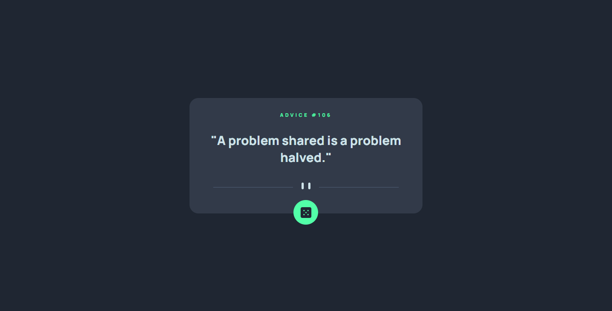

## Table of contents

- [Overview](#overview)
- [Screenshot](#screenshot)
- [Links](#links)
- [Built with](#built-with)
- [Author](#author)

## Overview

An Advice Web app using HTML, CSS, Javascipt. I have used Advice Slip API to get random advice in the app.

### Screenshot

### Links

- Solution URL: [https://github.com/Faizal2312/Advice-Slip](https://your-solution-url.com)
- Live Site URL: [https://faizal2312.github.io/Advice-Slip/](https://your-live-site-url.com)

### Built with

- Semantic HTML5 markup
- CSS custom properties
- Flexbox

## Author

- Website - [Advice Generator](https://www.your-site.com)
